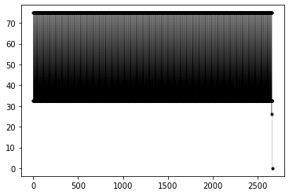
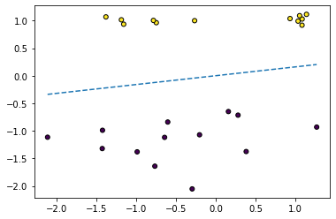
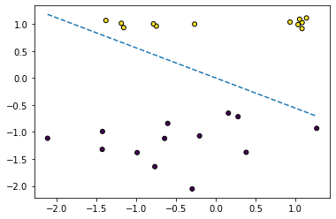
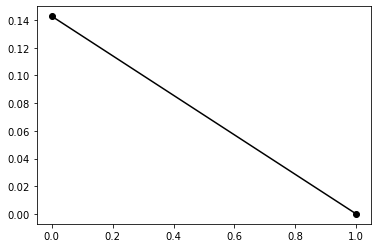

# Assignment 1 - Report

## Team members:
### Youssef Saleh  - 1170040
### Adham Khater - 1170529

-------

# Pseudocode Explanation:

## Batch Perceptron Algorithm:

    For the input, we take the x and y training data and an optional input of learning rate (for the scalar multiply value for delta change if needed) and an optional input of limited iterations (incase we want to exit the algorithm after a certian number of iteration).

    We then define the weights as random values from -1 to 1.

    And then we enter a loop where the break case condition is that the delta reached zero, by normalizing the delta and checking its value.

	We define the delta as an array of zeros with the same size of the training data
	Then we enter a for loop from 1 to the size of the training data:
		u = weights multipled (dot product) by x_training data
		if  y_training multiplied by u (both scalars) <= 0
			change/update delta
	Delta = Delta / size of training data (Averaging)
	Update weights

    This is repeated until the delta reaches a number near zero (almost-zero error delta).
 
## Online Batch Perceptron Algorithm:

    For the input, we take the x and y training data, an optional input of learning rate (for the scalar multiply value for delta change if needed) and an optional input of limited iterations (incase we want to exit the algorithm after a certian number of iteration).

    We then define the weights as random values from -1 to 1.

    And then we enter a loop where the break case condition is that the delta reached zero, by normalizing the delta and checking its value.

	We define the delta as an array of zeros with the same size of the training data

        Then we enter a for loop from 1 to the size of the training data:
            u = weights multipled (dot product) by x_training data
            if  y_training multiplied by u (both scalars) <= 0
                change/update delta
                Delta = Delta / size of training data (Averaging)
                Update weights

    This is repeated until the delta reaches a number near zero (almost-zero error delta).

The biggest difference here is that the update of weights is now inside the if condition along with the delta change.

-----

## Simple additions/changes to the pseudocode:
-	We now also calculate the Epochs (Number of iterations through the entire training data) which is counting how many times it repeated the for loop inside the algorithm to find correct result, hence the delta val that is closest to zero.
- In the batch algorithm we append in the delta if the condition is met, but the weights are updated either ways at the end of each iteration in the forloop.
- While in the Online batch algorithm, we append in the delta as well as update the weights if the condition is met during every iteration in the forloop.
- We have also added an additional input of learning rate and Iterations into the function, the iterations simply limits the while loop so that the algorithm doesn't enter an infinite loop (but by default, the iterations is infinity).
- In the online batch algorith, We added an if condition that checks if the delta was changed or in other words has the algoritm entered the if condition in the for loop. if not, we append the only version of delta which is zeros and exit the algorithm.
- Eventually, In the online batch algorithm, we added an if statement that would check if the weights were updated or not. doing this enabled us to append the final delta of zeros.

--------

# Comparisons:

## Problem 1:
    For Batch Perceptron : Problem 1 

    Epochs iterations: 2531

    Number of times model weight changed 2531

    Count of Significant delta changes: 2531
Plot of Significant deltas for batch:

 

    For Online Perceptron : Problem 1 

    Epochs iterations: 84

    Number of times model weight changed: 255

    Count of Significant delta changes: 256
Plot of Significant deltas for online:

 

## Problem 4:
    For Batch Perceptron : Problem 4 

    Epochs iterations: 7

    Number of times model weight changed: 7

    Count of Significant delta changes: 7

Plot of Significant deltas for batch:

 

    For Online Perceptron : Problem 4 

    Epochs iterations: 2

    Number of times model weight changed: 4

    Count of Significant delta changes: 5
Plot of Significant deltas for online:

 

## Random Data Problem:
### For Batch Algorithm:

    Possible Model Accuracy :  1.0

Scatter plot showing Predicted Model Line:

 

    For Batch Perceptron : 

    Epochs iterations: 2

    Number of times model weight changed: 2

    Count of Significant delta changes: 2

Plot of Significant deltas for batch:

 

### For Online Batch Algorithm:

    Possible Model Accuracy :  1.0

Scatter plot showing Predicted Model Line:

 

    For Online Perceptron : 

    Epochs iterations: 3

    Number of times model weight changed: 9

    Count of Significant delta changes: 10

Plot of Significant deltas for online:

 

-------
-------

## Odd case of Online Algorithm:

Possible Model Accuracy :  0.5714285714285714
 

    For Online Perceptron : 

    Epochs iterations: 1

    Number of times model weight changed: 0

    Count of Significant delta changes: 1

    Delta did not change, no need for plot
This literally means it did not enter the if condition that changes the weights and it used the random weights which brought a worse than usual predicted model line, Unlike the batch perceptron which had a better prediction and did in fact give a better model accuracy and model line visualization. that is why we have put an if condition in the online batch algortihm to check wether the delta was changed or not.

## Batch Perceptron Algorithm for the Odd Case:

Possible Model Accuracy :  0.8571428571428571
